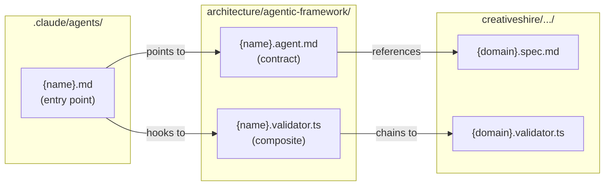
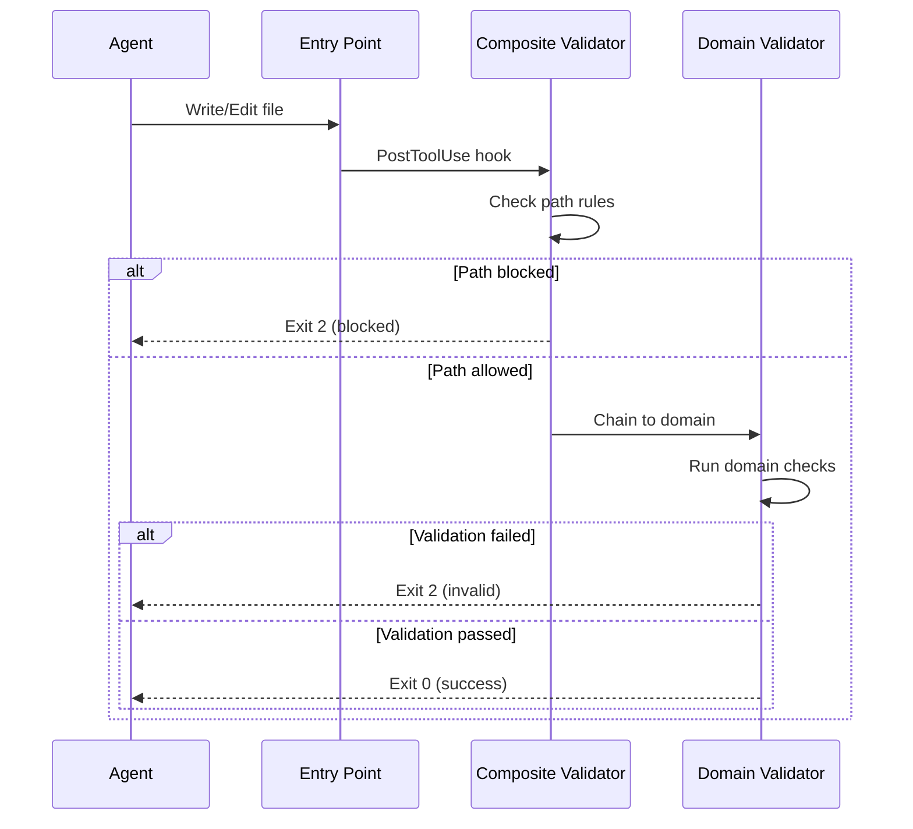

# Framework Guide

> Single source of truth for creating specs, contracts, and agents.

---

## Two Frameworks

| Framework | Question | Location |
|-----------|----------|----------|
| **Creativeshire** | WHAT is valid? | `creativeshire/{layer}/{domain}/` |
| **Agentic** | HOW do agents work? | `architecture/agentic-framework/` |

**Key principle:** Specs are reusable knowledge. Agent contracts are wiring.

---

## Files to Create

| Step | File | Template | Contains |
|------|------|----------|----------|
| 1 | `{domain}.spec.md` | `spec.template.md` | Domain rules |
| 2 | `{domain}.validator.ts` | `domain-validator.template.ts` | Validation code |
| 3 | `{name}.agent.md` | `agent-contract.template.md` | Agent scope |
| 4 | `{name}.validator.ts` | `composite-validator.template.ts` | Path rules + chain |
| 5 | `.claude/agents/{name}.md` | See Entry Point section | Hooks |

---

## Creation Flow

```mermaid
flowchart TB
    Q{Domain exists?}
    Q -->|No| SPEC[1. Create {domain}.spec.md]
    SPEC --> DVAL[2. Create {domain}.validator.ts]
    DVAL --> CONTRACT
    Q -->|Yes| CONTRACT[3. Create {name}.agent.md]
    CONTRACT --> CVAL[4. Create {name}.validator.ts]
    CVAL --> ENTRY[5. Create .claude/agents/{name}.md]
```

---

## Chain of References



---

## What Goes Where

### Spec (WHAT)

| Include | Exclude |
|---------|---------|
| Purpose | Agent scope |
| Concepts | File ownership |
| Interface (TypeScript) | Workflow steps |
| Rules: Must / Must Not | Delegation |
| CSS Variables | |
| Validation Rules table | |
| Template example | |
| Anti-Patterns | |
| Integration | |

### Agent Contract (HOW)

| Include | Exclude |
|---------|---------|
| Knowledge (which specs) | Domain rules |
| Scope: Can/Cannot touch | TypeScript interfaces |
| Input/Output | CSS variables |
| Workflow | Anti-patterns |
| Validation reference | |
| Delegation | |

---

## Agent Entry Point Template

```yaml
# .claude/agents/{name}.md
---
name: {name}
description: {One line}
tools: [Read, Write, Edit, Glob, Grep]
model: inherit
hooks:
  PostToolUse:
    - matcher: "Write|Edit"
      hooks:
        - type: command
          command: "npx tsx .claude/architecture/agentic-framework/{name}.validator.ts"
---

# {Name}

Read your contract: `.claude/architecture/agentic-framework/{name}.agent.md`
```

---

## Validation Flow



---

## Writing Standard

### Voice

| Do | Don't |
|----|-------|
| "Widgets render content" | "Widgets can render content" |
| "Returns structured output" | "It returns structured output" |
| Active voice, present tense | should, would, might, could |

### Density

| Section | Target |
|---------|--------|
| Purpose | 1-2 sentences |
| Rule | 1 sentence |
| Table row | < 15 words |

**Rule:** Tables over paragraphs. One sentence beats three.

### Length

| Document | Target | Limit |
|----------|--------|-------|
| Spec | ~150-250 | 300 |
| Contract | ~60-90 | 120 |

---

## Naming Conventions

| Type | Pattern |
|------|---------|
| Spec | `{domain}.spec.md` |
| Domain validator | `{domain}.validator.ts` |
| Agent contract | `{name}.agent.md` |
| Composite validator | `{name}.validator.ts` |
| Entry point | `.claude/agents/{name}.md` |

---

## Exit Codes

| Code | Meaning | Action |
|------|---------|--------|
| `0` | Pass | Continue |
| `1` | Validator crashed | Fix validator |
| `2` | Validation failed | Fix code, retry |

---

## Path Rules

```typescript
// Allowlist mode (executor agents)
const pathRules = {
  mode: 'allowlist',
  patterns: [/creativeshire\/content\/widgets\//],
}

// Blocklist mode (coordinator agents)
const pathRules = {
  mode: 'blocklist',
  patterns: [/creativeshire\//],
}
```

---

## Cross-Platform

| Context | Use |
|---------|-----|
| Hook commands | `npx tsx .claude/architecture/...` |
| TypeScript imports | Forward slashes |
| Regex matching | Forward slashes (paths normalized) |

**Never** use `$CLAUDE_PROJECT_DIR` in hooks.

---

## ESM Compatibility

```typescript
import { dirname } from 'path'
import { fileURLToPath } from 'url'

const __filename = fileURLToPath(import.meta.url)
const __dirname = dirname(__filename)
```

---

## Checklist: New Agent

- [ ] Domain spec exists (or create it)
- [ ] Domain validator exists (or create it)
- [ ] Agent contract created
- [ ] Composite validator created
- [ ] Entry point created with hooks
- [ ] Test: allowed path passes
- [ ] Test: blocked path fails
