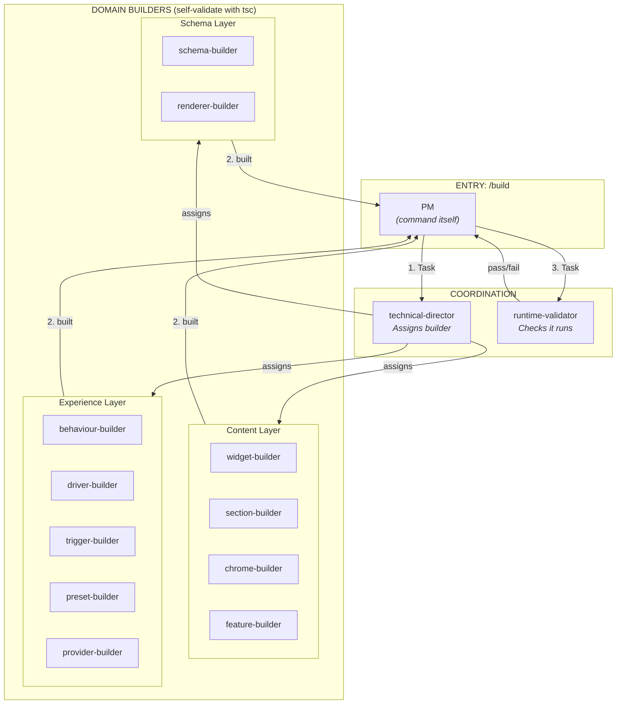
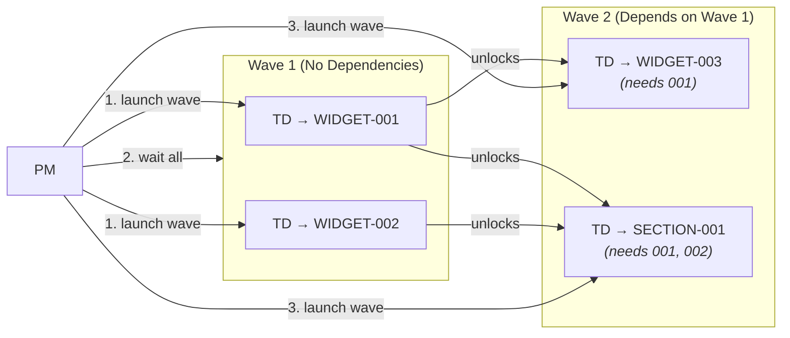

# /build Command Map

> Build workflow - from backlog item to working implementation.

---

## Overview

```
/build [item]
    │
    └── PM (the command itself)
        │
        ├── 1. technical-director
        │       └── Analyzes scope, assigns builder
        │
        ├── 2. [domain]-builder (self-validates)
        │       └── Implements + runs tsc + verifies imports
        │
        └── 3. runtime-validator (once)
                └── Checks page loads, no errors
```

**No reviewer in /build** - reviewers are in `/validate` (like PR review before merge).

---

## Agent Caller Diagram



**Reviewers are in `/validate`**, not `/build`. This separates "ship code" from "review before merge".

---

## Agents Called by /build

| Order | Agent | Purpose | Tools Used |
|-------|-------|---------|------------|
| 1 | `technical-director` | Analyze scope, assign builder | Glob, Grep, Read |
| 2 | `[domain]-builder` | Implement + self-validate (tsc) | Glob, Grep, Read, Write, Edit, Bash |
| 3 | `runtime-validator` | Check page loads, no errors | Bash |

**No reviewers in /build** - they're in `/validate`.

---

## Phase Details

### Pre-Flight (PM)

```bash
# If on main, create sprint branch
git checkout -b sprint/YYYY-MM-DD

# Start dev server
npm run dev
```

### Phase 1: TD Delegation

**Launch:** `Task(subagent_type="technical-director")`

**TD analyzes:**
- Which boundary is touched
- Which builder to assign
- Scope (files/folders)

**Returns:** Builder assignment and scope

### Phase 2: Builder (with self-validation)

**Launch:** `Task(subagent_type="[domain]-builder")`

**Builder does:**
1. Read existing patterns in scope
2. Implement following blueprint
3. Self-validate:
   - Run `tsc --noEmit` (fix errors before returning)
   - Verify imports resolve
   - Check files exist
4. Return files changed

**No separate reviewer** - builder ships working code.

### Phase 3: Runtime Validation

**Launch:** `Task(subagent_type="runtime-validator")`

**Validator checks:**
- Page loads at localhost:3000
- No console errors
- No hydration failures

**If fails:** Builder fixes (max 3 attempts)

### Post-Flight (PM)

```bash
# Commit changes
git add -A
git commit -m "feat(DOMAIN-XXX): description"

# Stay on sprint branch (DO NOT MERGE)
# Merge happens in /validate after review
```

---

## TD Specialist Routing

| Boundary Touched | Builder Assigned |
|------------------|------------------|
| `widgets/content/` or `widgets/layout/` | widget-builder |
| `widgets/composite/` | widget-composite-builder |
| `sections/Section.tsx` | section-builder |
| `sections/composites/` | section-composite-builder |
| `chrome/` | chrome-builder |
| `features/` | feature-builder |
| `experience/behaviours/` | behaviour-builder |
| `experience/drivers/` | driver-builder |
| `experience/triggers/` | trigger-builder |
| `experience/presets/` | preset-builder |
| `experience/*Provider.tsx` | provider-builder |
| `schema/` | schema-builder |
| `renderer/` | renderer-builder |

**Reviewers are assigned in `/validate`**, not here.

---

## Wave-Based Parallel Build

For multiple items (`/build WIDGET-001 to WIDGET-005` or `/build all`):



**Wave execution:**
1. PM reads `Dependencies:` field from backlog items
2. Groups items by dependency depth (wave 1 = no deps, wave 2 = depends on wave 1, etc.)
3. Launches all items in a wave in parallel (single message, multiple Task calls)
4. Waits for wave to complete
5. Launches next wave
6. Repeats until all waves done

---

## What /build Does NOT Do

- Read code files directly (TD and builders do)
- Write code directly (builders do)
- Make architectural decisions (TD does)
- Assign builders directly (TD does)
- **Review code** (reviewers are in `/validate`)
- **Merge to main** (`/validate` does)

---

## Output

- Implementation committed to sprint branch
- Item status set to "Ready for validation" in `current-sprint.md`
- Ready for `/validate` to review and merge
