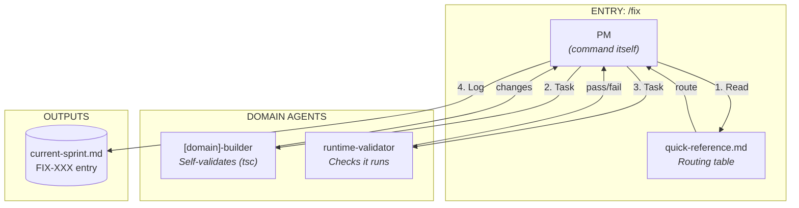

# /fix Command Map

> Lightweight fix workflow - fast path for small corrections.

---

## Overview

```
/fix [target] "description"
    │
    └── PM (the command itself)
        │
        ├── 1. Git setup (fix branch if on main)
        │
        ├── 2. Route to domain (via quick-reference)
        │
        ├── 3. [domain]-builder (self-validates)
        │       └── Implements fix + tsc + verifies imports
        │
        └── 4. runtime-validator (once)
                └── Checks no runtime errors
```

**Reviewer is in /validate** - same pattern as /build.

---

## Agent Caller Diagram



---

## Agents Called by /fix

| Order | Agent | Purpose | Tools Used |
|-------|-------|---------|------------|
| 1 | `[domain]-builder` | Make fix + self-validate (tsc) | Glob, Grep, Read, Write, Edit, Bash |
| 2 | `runtime-validator` | Check no runtime errors | Bash (Next.js MCP) |

**Reviewer is in /validate** - code review before merge, not during fix.

---

## Key Differences from /build

| Aspect | /fix | /build |
|--------|------|--------|
| **Context** | Quick-reference only | Full TD analysis |
| **TD Delegation** | NO (direct routing) | YES |
| **Builder Iterations** | 1 (single pass) | Wave-based (dependencies) |
| **Self-Validation** | Builder runs tsc | Builder runs tsc |
| **Runtime Check** | Yes (once) | Yes (once) |
| **Branch** | Fix branch or sprint | Sprint branch |
| **Tracking** | FIX-XXX in sprint | DOMAIN-XXX in sprint |

---

## Phase Details

### Phase 1: Git Setup (PM)

```bash
# Check current branch
BRANCH=$(git branch --show-current)

# If on main, create fix branch
if [ "$BRANCH" = "main" ]; then
    git checkout -b fix/YYYY-MM-DD-description
fi
```

### Phase 2: Quick Context (PM)

PM reads `quick-reference.md` and routes to domain:

| Path Contains | Builder |
|---------------|---------|
| `widgets/content/` or `widgets/layout/` | widget-builder |
| `widgets/composite/` | widget-composite-builder |
| `sections/composites/` | section-composite-builder |
| `sections/Section.tsx` | section-builder |
| `chrome/` | chrome-builder |
| `features/` | feature-builder |
| `experience/behaviours/` | behaviour-builder |
| `experience/drivers/` | driver-builder |
| `experience/triggers/` | trigger-builder |
| `experience/presets/` | preset-builder |
| `schema/` | schema-builder |
| `renderer/` | renderer-builder |

### Phase 3: Fix (Builder Self-Validates)

**Launch Builder:**
```
Task(
  subagent_type="[domain]-builder",
  description="Fix: [short description]",
  prompt="
    TASK: Quick fix - [description]
    TARGET FILE(S): [path]
    CONSTRAINTS:
    - This is a QUICK FIX, not a new feature
    - Make minimal changes
    - Follow existing patterns
    - Do not refactor unrelated code

    SELF-VALIDATION:
    - Run: tsc --noEmit (fix errors before returning)
    - Verify: all imports resolve
    - Check: files exist

    CRITICAL: Do not return until tsc passes.
  "
)
```

### Phase 4: Runtime Check

**Launch Runtime Validator:**
```
Task(
  subagent_type="runtime-validator",
  description="Check runtime errors after fix",
  prompt="
    TASK: Check for runtime errors via Next.js MCP
    PROCESS:
    1. Query nextjs_index for server on port 3000
    2. Query nextjs_call with toolName='get_errors'
    3. Return PASS or FAIL with errors
  "
)
```

### Phase 5: Commit & Track (PM)

```bash
git add [changed files]
git commit -m "fix: [description]"
```

Log in `current-sprint.md`:
```markdown
## Fixes (via /fix)

### FIX-001: [Short description]
- **Time:** [timestamp]
- **Files:** [list]
- **Status:** Ready for validation
```

---

## What /fix Does NOT Do

- Launch technical-director
- Run multiple builder iterations
- Run cleanup agents
- Create backlog items
- Full exploration
- Code review (that's in /validate)

---

## When NOT to Use /fix

Use `/plan` → `/build` instead for:
- New features
- Multi-file refactors
- Architectural changes
- Unknown bugs requiring investigation

---

## Handle Runtime Failures

**If PASS:**
→ Proceed to commit

**If FAIL:**
```
Runtime errors after fix:
- Error 1: [description]

Options:
1. Run /fix again with adjusted description
2. Run /build for full iteration loop
3. Revert changes
```

**No automatic re-iteration.** Use `/build` if multiple iterations needed.

---

## Output

- FIX-XXX entry in `current-sprint.md` (status: Ready for validation)
- Changes committed to fix/sprint branch
- Ready for `/validate FIX-XXX` to review and merge

---

## Validation Flow

```
/fix → FIX-XXX (Ready for validation)
         │
         ▼
/validate FIX-XXX
         │
         ├── tsc, build, runtime, reviewer
         │
         ├── PASS → Merge fix branch to main
         │
         └── FAIL → Retake → /fix continue
```
