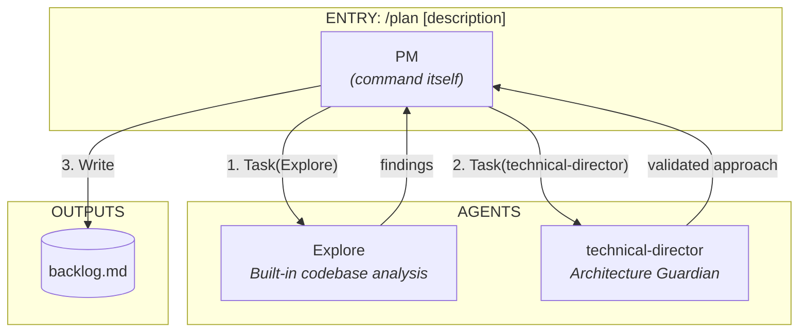
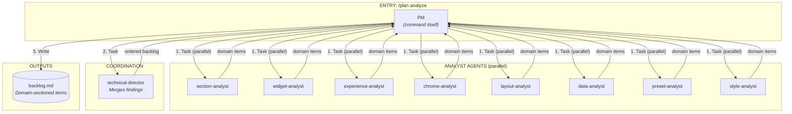

# /plan Command Map

> Planning workflow - from user request to backlog item.

---

## Sub-Commands

| Sub-Command | Purpose | Agents Used |
|-------------|---------|-------------|
| `/plan [description]` | General planning (features, investigations, enhancements) | Explore, technical-director |
| `/plan refactor [what]` | Domain model updates, migrations | Explore, technical-director |
| `/plan analyze <URL\|path\|description>` | Analyze reference or description, create backlog | 8 analysts, technical-director |

---

## Overview: /plan [description]

```
/plan [description]
    │
    └── PM (the command itself)
        │
        ├── 1. Explore agent
        │       └── Analyzes codebase, finds patterns, identifies key files
        │
        └── 2. technical-director
                └── Validates approach, identifies boundaries & domain agents
```

---

## Agent Caller Diagram: /plan [description]



---

## Agent Caller Diagram: /plan analyze



---

## Agents Called by /plan

### /plan [description] and /plan refactor

| Order | Agent | Purpose | Tools Used |
|-------|-------|---------|------------|
| 1 | `Explore` | Analyze codebase for relevant patterns, files, conventions | Glob, Grep, Read |
| 2 | `technical-director` | Validate approach against architecture, identify domain agents | Glob, Grep, Read |

### /plan analyze

| Order | Agent | Purpose | Tools Used |
|-------|-------|---------|------------|
| 1 | `section-analyst` | Identify section patterns from reference | WebFetch, Read, Glob, Grep |
| 1 | `widget-analyst` | Identify widget components from reference | WebFetch, Read, Glob, Grep |
| 1 | `experience-analyst` | Identify animations/interactions from reference | WebFetch, Read, Glob, Grep |
| 1 | `chrome-analyst` | Identify persistent UI (header/footer) from reference | WebFetch, Read, Glob, Grep |
| 1 | `layout-analyst` | Identify layout patterns from reference | WebFetch, Read, Glob, Grep |
| 1 | `data-analyst` | Identify content data patterns from reference | WebFetch, Read, Glob, Grep |
| 1 | `preset-analyst` | Identify site composition patterns from reference | WebFetch, Read, Glob, Grep |
| 1 | `style-analyst` | Identify design tokens from reference | WebFetch, Read, Glob, Grep |
| 2 | `technical-director` | Merge findings, resolve dependencies, set build order | Glob, Grep, Read |

---

## Phase Details

### Shared: Phase 0 - Git Setup (PM)

PM ensures we're on main branch before creating backlog items.

```bash
git checkout main && git pull origin main
```

---

## /plan [description] Phases

### Phase 1: Discovery (PM)

PM parses user request type:
- Feature (new functionality)
- Investigation (analysis, research)
- Enhancement (improve existing)

### Phase 2: Exploration

**Launch:** `Task(subagent_type="Explore")`

**Agent finds:**
- Existing components/patterns
- Integration points
- Conventions to follow
- Key files (5-10 most important)

**Returns:** Structured exploration report

### Phase 3: Architecture

**Launch:** `Task(subagent_type="technical-director")`

**TD validates:**
- Which boundaries are touched
- Which domain agents would implement
- Layer separation compliance
- Animation model compliance
- SOLID/DRY principles

**Returns:** Validated approach with domain agent assignments

### Phase 4: Backlog Creation (PM)

PM writes to `backlog.md`:
- Item ID (ITEM-XXX)
- Description & Context
- Approach (from TD)
- Specialist assignments
- Acceptance criteria

---

## /plan refactor Phases

Same as `/plan [description]` but with focus on:
- Domain model changes
- Migration paths
- Breaking change analysis
- Parity requirements

**Item Type:** Always "Refactor" or "Migration"

---

## /plan analyze Phases

### Phase 1: Reference Detection (PM)

PM determines reference type:
- **URL** (starts with `http://` or `https://`) → Website workflow
- **Path** (local or git) → Source code workflow
- **Description** (quoted string or plain text) → Description workflow

### Phase 2: Parallel Analysis

**Launch 8 analysts in parallel:**

```
Task(subagent_type="section-analyst", run_in_background=true, ...)
Task(subagent_type="widget-analyst", run_in_background=true, ...)
Task(subagent_type="experience-analyst", run_in_background=true, ...)
Task(subagent_type="chrome-analyst", run_in_background=true, ...)
Task(subagent_type="layout-analyst", run_in_background=true, ...)
Task(subagent_type="data-analyst", run_in_background=true, ...)
Task(subagent_type="preset-analyst", run_in_background=true, ...)
Task(subagent_type="style-analyst", run_in_background=true, ...)
```

Each analyst:
- Examines reference for domain-specific patterns
- Creates analysis file in `.claude/analysis/{domain}.md`
- Returns structured findings with domain-prefixed IDs

### Phase 3: TD Review

**Launch:** `Task(subagent_type="technical-director")`

**TD merges:**
- Analyst findings
- Resolves dependencies
- Sets build order
- Reports summary

### Phase 4: Backlog Creation (PM)

PM extracts items from analysis files to `backlog.md`:
- `SECTION-XXX` items from `sections.md`
- `WIDGET-XXX` items from `widgets.md`
- `CHROME-XXX` items from `chrome.md`
- `EXPERIENCE-XXX` items from `experience.md`
- `LAYOUT-XXX` items from `layout.md`
- `DATA-XXX` items from `data.md`
- `PRESET-XXX` items from `preset.md`
- `STYLE-XXX` items from `styles.md`

Build order from `SUMMARY.md` determines priority.

---

## Analysis Folder Workflow

```
/plan analyze <reference>
         │
         ▼
┌─────────────────────────────────────┐
│  Analysts create analysis files:    │
│  .claude/analysis/{domain}.md       │
└─────────────────────────────────────┘
         │
         ▼
┌─────────────────────────────────────┐
│  TD creates SUMMARY.md:             │
│  - Merges findings                  │
│  - Resolves dependencies            │
│  - Sets build order                 │
└─────────────────────────────────────┘
         │
         ▼
┌─────────────────────────────────────┐
│  PM extracts to backlog.md:         │
│  - SECTION-XXX, WIDGET-XXX, etc.    │
│  - Ordered by TD build sequence     │
└─────────────────────────────────────┘
```

---

## What /plan Does NOT Do

- Read code files directly (Explore/analysts do)
- Design architecture (TD does)
- Spawn builder/reviewer agents
- Edit any code files
- Make implementation decisions
- Implement anything (use `/build` for that)

---

## Specialist Mapping

When TD identifies boundaries, map to domain agents:

| Boundary | Builder | Reviewer |
|----------|---------|----------|
| Widget | widget-builder | widget-reviewer |
| Widget Composite | widget-composite-builder | widget-composite-reviewer |
| Section | section-builder | section-reviewer |
| Section Composite | section-composite-builder | section-composite-reviewer |
| Chrome | chrome-builder | chrome-reviewer |
| Feature | feature-builder | feature-reviewer |
| Behaviour | behaviour-builder | behaviour-reviewer |
| Driver | driver-builder | driver-reviewer |
| Trigger | trigger-builder | trigger-reviewer |
| Preset | preset-builder | preset-reviewer |
| Provider | provider-builder | provider-reviewer |
| Schema | schema-builder | (tsc --noEmit) |
| Renderer | renderer-builder | renderer-reviewer |

---

## Output

### /plan [description] and /plan refactor

A well-formed backlog item in `.claude/tasks/backlog.md`:

```markdown
#### [DOMAIN-XXX] Title

- **Type:** Feature | Refactor | Migration | Enhancement
- **Priority:** P0 | P1 | P2 | P3
- **Estimate:** S | M | L | XL
- **Dependencies:** DOMAIN-XXX, DOMAIN-YYY | None  ← REQUIRED
- **Added:** YYYY-MM-DD
- **Description:** ...
- **Context:** Key files, patterns
- **Approach:** TD-validated approach
- **Specialists:** Builder/Reviewer pair
- **Acceptance Criteria:** Checkboxes
```

**Dependencies field is REQUIRED** - TD must identify during planning. `/build` uses this to determine build order.

### /plan analyze

**Analysis Files** (created by analysts):

```
.claude/analysis/
├── sections.md      # SECTION-XXX items
├── widgets.md       # WIDGET-XXX items
├── chrome.md        # CHROME-XXX items
├── experience.md    # EXPERIENCE-XXX items
├── layout.md        # LAYOUT-XXX items
├── data.md          # DATA-XXX items
├── preset.md        # PRESET-XXX items
├── styles.md        # STYLE-XXX items
└── SUMMARY.md       # TD-generated build order
```

**Naming Convention:**

| Domain | Prefix | Example |
|--------|--------|---------|
| Section | `SECTION-XXX` | `SECTION-001` |
| Widget | `WIDGET-XXX` | `WIDGET-001` |
| Chrome | `CHROME-XXX` | `CHROME-001` |
| Experience | `EXPERIENCE-XXX` | `EXPERIENCE-001` |
| Layout | `LAYOUT-XXX` | `LAYOUT-001` |
| Data | `DATA-XXX` | `DATA-001` |
| Preset | `PRESET-XXX` | `PRESET-001` |
| Style | `STYLE-XXX` | `STYLE-001` |

**Backlog Format** (extracted from analysis):

```markdown
## Backlog Items

### Sections
- [SECTION-001] Hero with video background
- [SECTION-002] Project gallery grid

### Widgets
- [WIDGET-001] Animated text reveal
- [WIDGET-002] Image with lazy loading

### Chrome
- [CHROME-001] Sticky header with scroll-aware styling

### Experience
- [EXPERIENCE-001] Scroll-triggered reveals

### Layout
- [LAYOUT-001] Masonry grid for portfolio

### Data
- [DATA-001] Project collection schema

### Preset
- [PRESET-001] Portfolio showcase preset

### Style
- [STYLE-001] Design tokens for theme
```
