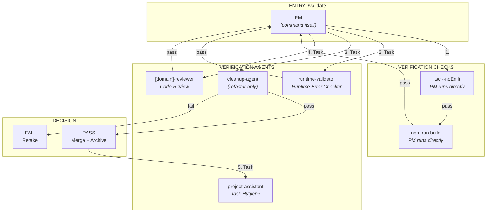
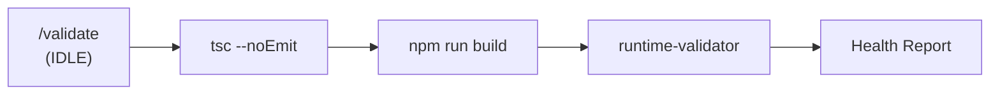

# /validate Command Map

> Validation workflow - quality gate before merge to main.

---

## Overview

```
/validate [item or blank]
    │
    └── PM (the command itself)
        │
        ├── 1. TypeScript check (tsc --noEmit)
        │
        ├── 2. Build check (npm run build)
        │
        ├── 3. runtime-validator
        │       └── Queries Next.js MCP for errors
        │
        ├── 4. [domain]-reviewer
        │       └── Code review (like PR review before merge)
        │
        ├── 5. cleanup-agent (if refactor)
        │       └── Verifies no legacy code
        │
        └── 6. project-assistant (after archive)
                └── Verifies task hygiene
```

---

## Agent Caller Diagram



---

## Agents Called by /validate

| Order | Agent/Check | Purpose | When Run |
|-------|-------------|---------|----------|
| 1 | `tsc --noEmit` | TypeScript errors | Always |
| 2 | `npm run build` | Build errors | Always |
| 3 | `runtime-validator` | Runtime errors via MCP | Always |
| 4 | `[domain]-reviewer` | Code review (like PR review) | Always |
| 5 | `cleanup-agent` | No legacy code | Refactor/Migration only |
| 6 | `project-assistant` | Task hygiene | After archive |

---

## Checks by Item Type

| Item Type | tsc | build | runtime | reviewer | cleanup | project-assistant |
|-----------|-----|-------|---------|----------|---------|-------------------|
| Feature | ✓ | ✓ | ✓ | ✓ | - | ✓ |
| Bug Fix | ✓ | ✓ | ✓ | ✓ | - | ✓ |
| Refactor | ✓ | ✓ | ✓ | ✓ | ✓ | ✓ |
| Migration | ✓ | ✓ | ✓ | ✓ | ✓ | ✓ |
| **FIX-XXX** | ✓ | ✓ | ✓ | ✓ | - | - |

---

## Phase Details

### Phase 1: Static Analysis (PM runs directly)

```bash
# TypeScript check
npx tsc --noEmit

# Build check
npm run build
```

**FAIL fast:** If either fails, skip remaining checks and mark Retake.

### Phase 2: Runtime Check

**Launch:** `Task(subagent_type="runtime-validator")`

**Agent checks:**
- Console errors
- Hydration mismatches
- Invalid HTML elements
- React warnings

**Uses:** Next.js MCP (`nextjs_index`, `nextjs_call`)

### Phase 3: Code Review

**Launch:** `Task(subagent_type="[domain]-reviewer")`

**TD routes to domain-specific reviewer:**
- WIDGET-XXX → widget-reviewer
- SECTION-XXX → section-reviewer
- CHROME-XXX → chrome-reviewer
- BEHAVIOUR-XXX → behaviour-reviewer
- DRIVER-XXX → driver-reviewer
- TRIGGER-XXX → trigger-reviewer
- PRESET-XXX → preset-reviewer
- PROVIDER-XXX → provider-reviewer
- RENDERER-XXX → renderer-reviewer
- FEATURE-XXX → feature-reviewer

**Reviewer verifies:**
- Code follows domain spec
- No anti-patterns
- Naming conventions
- Proper exports

### Phase 4: Cleanup Check (Refactor/Migration Only)

**Launch:** `Task(subagent_type="cleanup-agent")`

**Agent verifies:**
- No imports reference deleted files
- No "Legacy" or "Old" prefixed files
- No commented-out old code
- Type exports updated
- Index files updated

### Phase 5: Merge & Archive (On PASS)

```bash
# Switch to main
git checkout main && git pull

# Merge sprint branch
git merge sprint/YYYY-MM-DD --no-ff

# Delete sprint branch
git branch -d sprint/YYYY-MM-DD
```

Create `completed/ITEM-XXX.md` and update index.

### Phase 6: Task Hygiene

**Launch:** `Task(subagent_type="project-assistant")`

**Agent verifies:**
- ID sequence (no gaps)
- Index accuracy
- Completion format
- Backlog sync

---

## Decision Logic

```
All checks PASS?
├── YES → MERGE & ARCHIVE
│   1. Merge sprint to main
│   2. Delete sprint branch
│   3. Create completed/DOMAIN-XXX.md
│   4. Update completed/index.md
│   5. Reset current-sprint.md
│   6. Launch project-assistant
│
└── NO → RETAKE
    1. Mark status "Retake"
    2. Add issues list
    3. Stay on sprint branch
    4. DO NOT merge ANY items
```

---

## Retake Flow

```
/validate → FAIL → Retake status
    │
    ▼
/build continue
    │
    ▼
Builder fixes issues (self-validates)
    │
    ▼
Status → "Ready for validation"
    │
    ▼
/validate → PASS → Archive
```

---

## Generalized Validation (IDLE Sprint)

When no active items, `/validate` runs a health check:



**Output:** Health report (no merge/archive)

---

## What /validate Does NOT Do

- Read code files directly (agents do)
- Write code (retake goes back to /build)
- Explore codebase (specialized agents do)
- Make architectural decisions
- Skip any required checks

---

## Runtime Errors Commonly Caught

| Error | Cause | Example |
|-------|-------|---------|
| Invalid HTML tag | Bad variant prop | `<heading>` instead of `<h1>` |
| Invalid HTML nesting | Reserved element | `<body>` inside `<div>` |
| Hydration mismatch | Server/client differs | Dynamic values |
| Multiple body | Component renders `<body>` | Text with `variant="body"` |

---

## Output

On **PASS:**
- Sprint branch merged to main
- Sprint branch deleted
- `completed/DOMAIN-XXX.md` created
- `completed/index.md` updated
- `current-sprint.md` reset
- Task hygiene verified

On **FAIL:**
- Items marked "Retake"
- Issues documented
- Sprint branch kept
- Ready for `/build continue`
