# Knowledge Coverage Graph

> Generated: 2026-01-25T19:24:27.618Z
> Coverage: 59/59 files (100%)

## Visualization

```mermaid
mindmap
  root((Creativeshire))
    L0 Schema
      ["schema.spec.md"]
        ["project-assistant"]
        ["schema-builder"]
        ["technical-director"]
      ["schema.validator.ts"]
        ["schema-builder"]
    L1 Content
      ["chrome.spec.md"]
        ["chrome-analyst"]
        ["chrome-builder"]
        ["chrome-reviewer"]
        ["inventory-agent"]
        ["project-assistant"]
        ["technical-director"]
      ["chrome.validator.ts"]
        ["chrome-builder"]
        ["chrome-reviewer"]
      ["feature.spec.md"]
        ["feature-builder"]
        ["feature-reviewer"]
        ["project-assistant"]
        ["section-reviewer"]
        ["style-analyst"]
        ["technical-director"]
        ["widget-builder"]
        ["widget-reviewer"]
      ["feature.validator.ts"]
        ["feature-builder"]
        ["feature-reviewer"]
      ["section-composite.spec.md"]
        ["project-assistant"]
        ["section-analyst"]
        ["section-composite-builder"]
        ["section-composite-reviewer"]
        ["technical-director"]
      ["section-composite.validator.ts"]
        ["section-composite-builder"]
        ["section-composite-reviewer"]
      ["section.spec.md"]
        ["feature-builder"]
        ["feature-reviewer"]
        ["inventory-agent"]
        ["layout-analyst"]
        ["project-assistant"]
        ["runtime-validator"]
        ["schema-builder"]
        ["section-analyst"]
        ["section-builder"]
        ["section-composite-builder"]
        ["section-composite-reviewer"]
        ["section-reviewer"]
        ["technical-director"]
        ["widget-builder"]
      ["section.validator.ts"]
        ["section-builder"]
        ["section-reviewer"]
      ["widget-composite.spec.md"]
        ["project-assistant"]
        ["section-composite-reviewer"]
        ["technical-director"]
        ["widget-analyst"]
        ["widget-composite-builder"]
        ["widget-composite-reviewer"]
      ["widget-composite.validator.ts"]
        ["widget-composite-builder"]
        ["widget-composite-reviewer"]
      ["widget.spec.md"]
        ["chrome-builder"]
        ["chrome-reviewer"]
        ["feature-builder"]
        ["feature-reviewer"]
        ["inventory-agent"]
        ["layout-analyst"]
        ["project-assistant"]
        ["runtime-validator"]
        ["schema-builder"]
        ["section-builder"]
        ["section-composite-builder"]
        ["section-reviewer"]
        ["technical-director"]
        ["widget-analyst"]
        ["widget-builder"]
        ["widget-composite-builder"]
        ["widget-composite-reviewer"]
        ["widget-reviewer"]
      ["widget.validator.ts"]
        ["widget-builder"]
        ["widget-reviewer"]
    L2 Experience
      ["behaviour.spec.md"]
        ["behaviour-builder"]
        ["behaviour-reviewer"]
        ["chrome-analyst"]
        ["chrome-builder"]
        ["driver-builder"]
        ["driver-reviewer"]
        ["experience-analyst"]
        ["preset-reviewer"]
        ["project-assistant"]
        ["provider-reviewer"]
        ["renderer-reviewer"]
        ["schema-builder"]
        ["section-builder"]
        ["technical-director"]
        ["trigger-builder"]
      ["behaviour.validator.ts"]
        ["behaviour-builder"]
        ["behaviour-reviewer"]
      ["driver.spec.md"]
        ["behaviour-builder"]
        ["behaviour-reviewer"]
        ["driver-builder"]
        ["driver-reviewer"]
        ["experience-analyst"]
        ["project-assistant"]
        ["provider-builder"]
        ["provider-reviewer"]
        ["technical-director"]
        ["trigger-reviewer"]
      ["driver.validator.ts"]
        ["driver-builder"]
        ["driver-reviewer"]
      ["mode.spec.md"]
        ["preset-analyst"]
        ["project-assistant"]
        ["provider-builder"]
        ["technical-director"]
      ["provider.spec.md"]
        ["driver-reviewer"]
        ["project-assistant"]
        ["provider-builder"]
        ["provider-reviewer"]
        ["technical-director"]
        ["trigger-builder"]
        ["trigger-reviewer"]
      ["provider.validator.ts"]
        ["provider-builder"]
        ["provider-reviewer"]
      ["trigger.spec.md"]
        ["behaviour-builder"]
        ["behaviour-reviewer"]
        ["driver-builder"]
        ["experience-analyst"]
        ["preset-reviewer"]
        ["project-assistant"]
        ["technical-director"]
        ["trigger-builder"]
        ["trigger-reviewer"]
      ["trigger.validator.ts"]
        ["trigger-builder"]
        ["trigger-reviewer"]
    L3 Interface
      ["interface.spec.md"]
        ["project-assistant"]
        ["technical-director"]
    L4 Preset
      ["preset.spec.md"]
        ["preset-analyst"]
        ["preset-builder"]
        ["preset-reviewer"]
        ["project-assistant"]
        ["technical-director"]
      ["preset.validator.ts"]
        ["preset-builder"]
        ["preset-reviewer"]
    L5 Site
      ["site.spec.md"]
        ["data-analyst"]
        ["page-builder"]
        ["project-assistant"]
        ["site-builder"]
        ["technical-director"]
      ["site.validator.ts"]
        ["page-builder"]
        ["site-builder"]
    Renderer
      ["renderer.spec.md"]
        ["project-assistant"]
        ["renderer-builder"]
        ["renderer-reviewer"]
        ["technical-director"]
      ["renderer.validator.ts"]
        ["renderer-builder"]
        ["renderer-reviewer"]
    Layers
      ["content.spec.md"]
        ["project-assistant"]
        ["technical-director"]
      ["experience.spec.md"]
        ["project-assistant"]
        ["technical-director"]
      ["preset.spec.md"]
        ["preset-analyst"]
        ["project-assistant"]
        ["technical-director"]
      ["renderer.spec.md"]
        ["project-assistant"]
        ["renderer-reviewer"]
        ["technical-director"]
      ["schema.spec.md"]
        ["project-assistant"]
        ["technical-director"]
      ["site-instance.spec.md"]
        ["data-analyst"]
        ["project-assistant"]
        ["technical-director"]
    Core
      ["contracts.spec.md"]
        ["project-assistant"]
        ["technical-director"]
      ["extension.spec.md"]
        ["project-assistant"]
      ["glossary.spec.md"]
        ["project-assistant"]
      ["philosophy.spec.md"]
        ["inventory-agent"]
        ["project-assistant"]
        ["technical-director"]
      ["platform.spec.md"]
        ["project-assistant"]
    Reference
      ["caching.spec.md"]
        ["project-assistant"]
      ["css-variables.spec.md"]
        ["project-assistant"]
        ["style-analyst"]
      ["file-patterns.spec.md"]
        ["project-assistant"]
      ["folders.spec.md"]
        ["project-assistant"]
      ["naming.spec.md"]
        ["chrome-analyst"]
        ["experience-analyst"]
        ["layout-analyst"]
        ["project-assistant"]
        ["section-analyst"]
        ["widget-analyst"]
      ["styling.spec.md"]
        ["project-assistant"]
        ["style-analyst"]
      ["tech-stack.spec.md"]
        ["project-assistant"]
    Testing
      ["integration.spec.md"]
        ["project-assistant"]
      ["strategy.spec.md"]
        ["project-assistant"]
      ["unit.spec.md"]
        ["project-assistant"]
      ["visual.spec.md"]
        ["project-assistant"]
    Patterns
      ["anti-patterns.spec.md"]
        ["project-assistant"]
      ["common.spec.md"]
        ["behaviour-builder"]
        ["chrome-analyst"]
        ["chrome-builder"]
        ["driver-builder"]
        ["experience-analyst"]
        ["layout-analyst"]
        ["project-assistant"]
        ["section-analyst"]
        ["section-builder"]
        ["section-composite-builder"]
        ["trigger-builder"]
        ["widget-analyst"]
        ["widget-builder"]
        ["widget-composite-builder"]
      ["data-fetching.spec.md"]
        ["project-assistant"]
      ["hydration.spec.md"]
        ["project-assistant"]
      ["performance.spec.md"]
        ["project-assistant"]
    Diagrams
      ["index.spec.md"]
        ["project-assistant"]
    Other
      ["index.spec.md"]
        ["inventory-agent"]
        ["project-assistant"]
        ["runtime-validator"]
        ["technical-director"]
```

## Layer Summary

| Layer | Files | Agents |
|-------|-------|--------|
| L0 Schema | 2 | project-assistant, schema-builder, technical-director |
| L1 Content | 12 | chrome-analyst, chrome-builder, chrome-reviewer, +19 more |
| L2 Experience | 9 | behaviour-builder, behaviour-reviewer, chrome-analyst, +15 more |
| L3 Interface | 1 | project-assistant, technical-director |
| L4 Preset | 2 | preset-analyst, preset-builder, preset-reviewer, +2 more |
| L5 Site | 2 | data-analyst, page-builder, project-assistant, +2 more |
| Renderer | 2 | project-assistant, renderer-builder, renderer-reviewer, +1 more |
| Layers | 6 | data-analyst, preset-analyst, project-assistant, +2 more |
| Core | 5 | inventory-agent, project-assistant, technical-director |
| Reference | 7 | chrome-analyst, experience-analyst, layout-analyst, +4 more |
| Testing | 4 | project-assistant |
| Patterns | 5 | behaviour-builder, chrome-analyst, chrome-builder, +11 more |
| Diagrams | 1 | project-assistant |
| Other | 1 | inventory-agent, project-assistant, runtime-validator, +1 more |
