# Architecture Diagrams

> Visual reference for Creativeshire architecture concepts.

---

## Table of Contents

- [System Overview](#system-overview)
  - [Complete System](#complete-system)
  - [Main Architecture Flow](#main-architecture-flow)
- [Presets and Configuration](#presets-and-configuration)
  - [Preset to Site to Render Flow](#preset-to-site-to-render-flow)
  - [Preset Structure](#preset-structure)
- [Experience Layer](#experience-layer)
  - [Mode and Behaviour Resolution](#mode-and-behaviour-resolution)
  - [Driver Pattern](#driver-pattern)
  - [Intrinsic vs Extrinsic Sizing](#intrinsic-vs-extrinsic-sizing)
  - [Behaviour Structure](#behaviour-structure)
  - [Mode Definition Structure](#mode-definition-structure)
- [Content Layer](#content-layer)
  - [Content Hierarchy](#content-hierarchy)
  - [The Frame Pattern](#the-frame-pattern)
- [Rendering](#rendering)
  - [The Contract](#the-contract)
  - [Widget Renderer](#widget-renderer)
  - [Section Renderer](#section-renderer)
  - [Chrome Resolution](#chrome-resolution)
- [Quick Reference](#quick-reference)
- [See Also](#see-also)

---

## System Overview

### Complete System

The complete Creativeshire system showing the CMS engine, site instance, and Next.js routing integration.

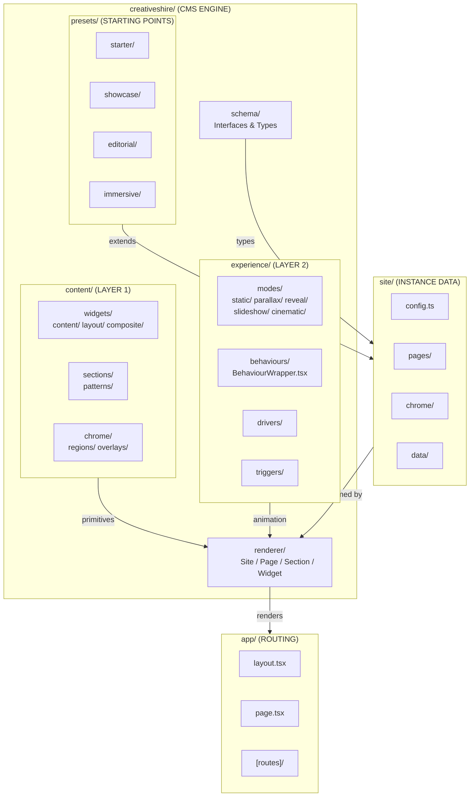

---

### Main Architecture Flow

The complete data flow from schema definitions through rendering to final visual output.

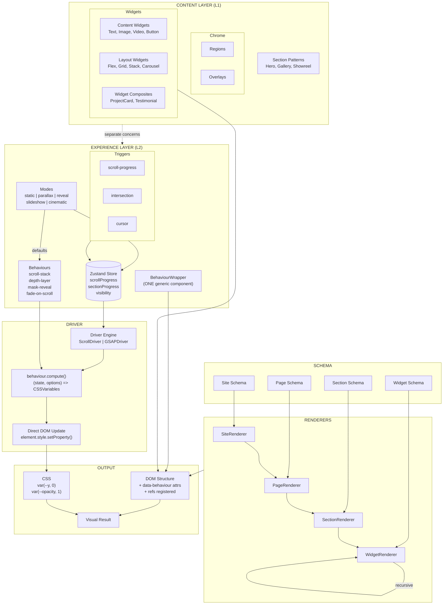

---

## Presets and Configuration

### Preset to Site to Render Flow

How presets are extended by site data and consumed by renderers.

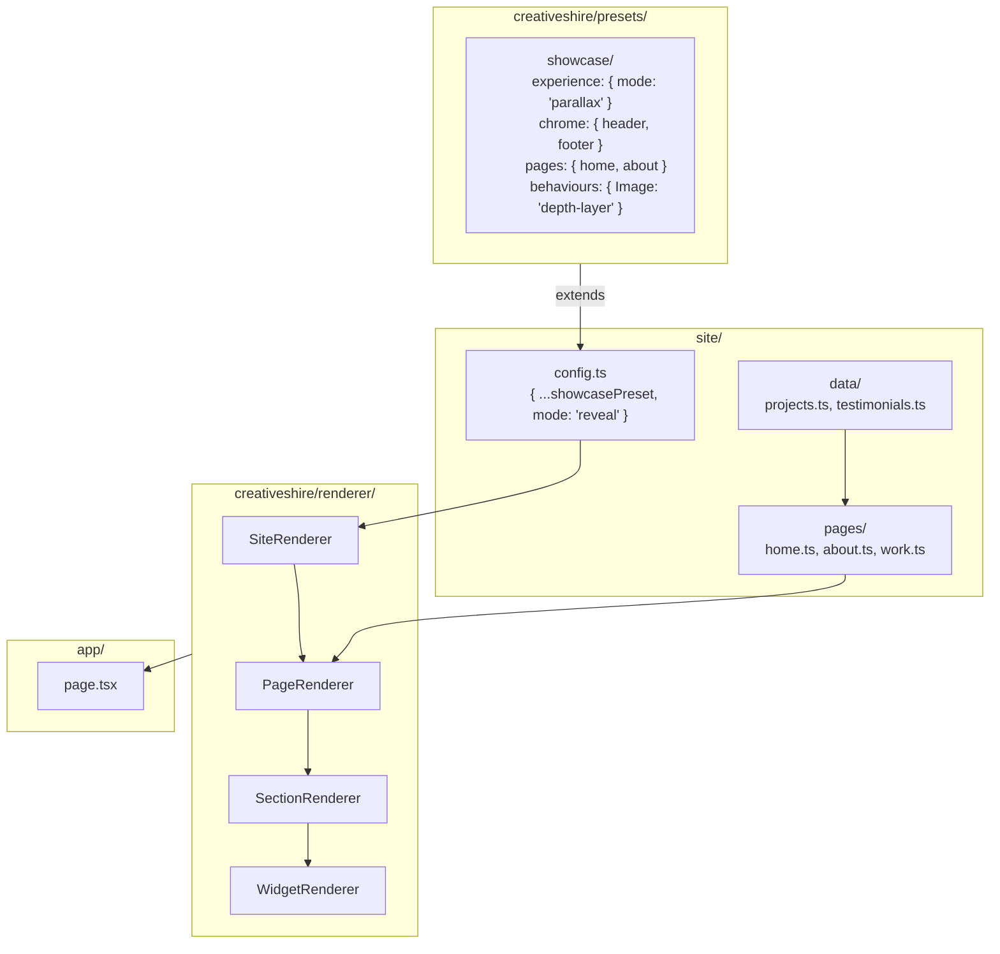

---

### Preset Structure

What a preset contains and how sites extend it.

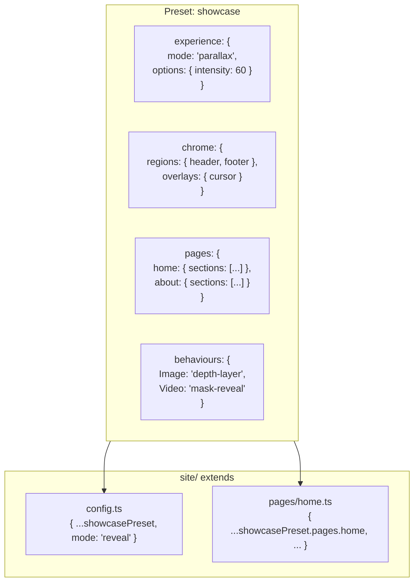

---

## Experience Layer

### Mode and Behaviour Resolution

How behaviours are resolved from mode defaults or explicit overrides.

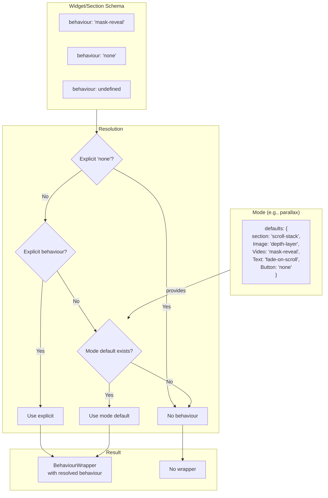

---

### Driver Pattern

Contrasts traditional React animation vs the Creativeshire driver pattern.

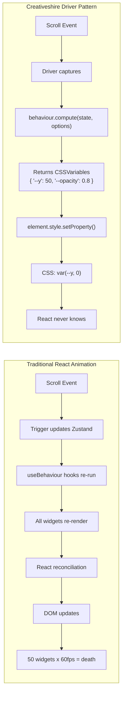

---

### Intrinsic vs Extrinsic Sizing

How content determines size (L1) vs context imposing size (L2).

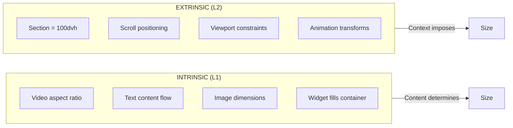

---

### Behaviour Structure

How a behaviour is defined and used at runtime.

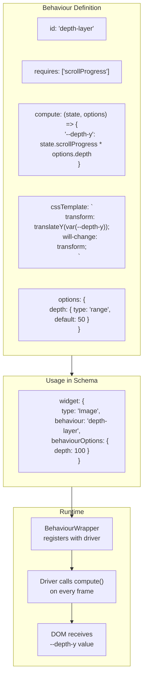

---

### Mode Definition Structure

What a mode contains and how it is used.

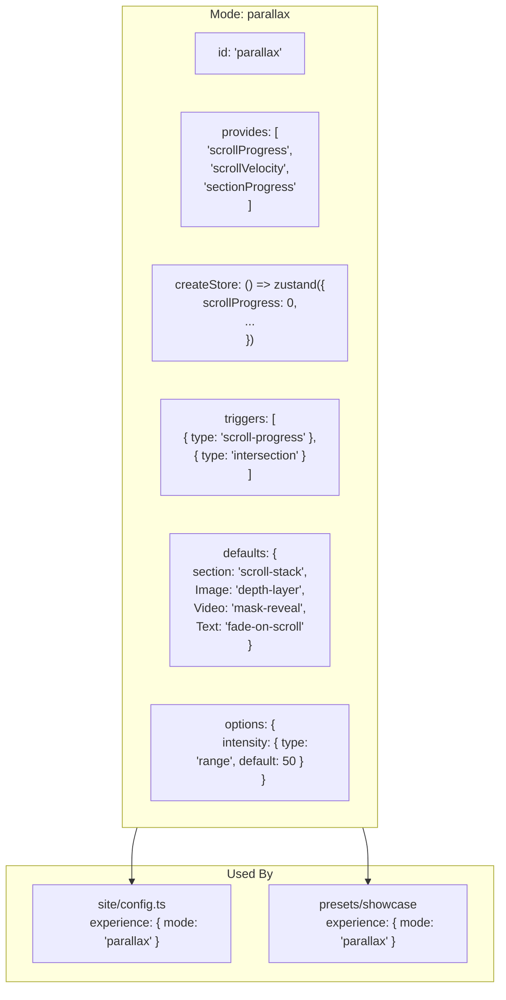

---

## Content Layer

### Content Hierarchy

How content is structured from Site down to nested Widgets.

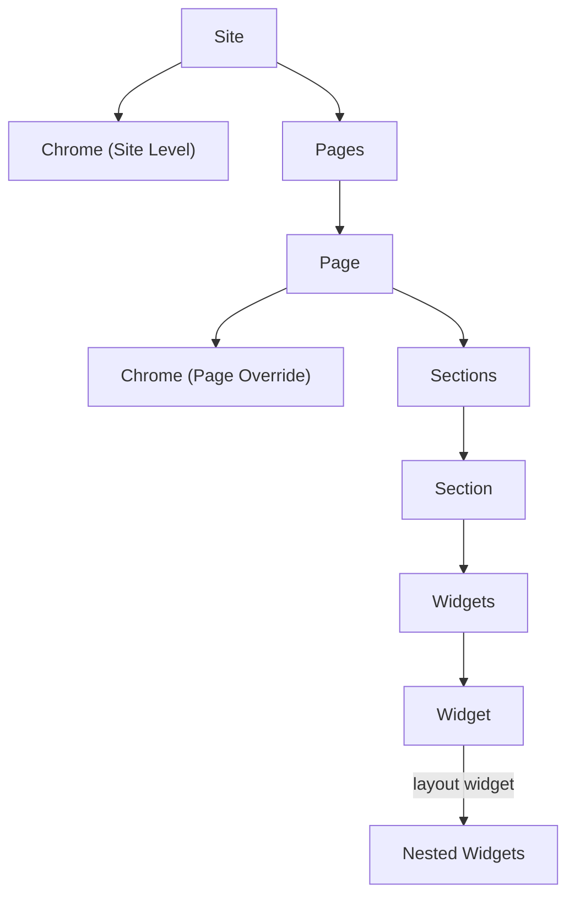

---

### The Frame Pattern

How BehaviourWrapper wraps content at any level with the frame pattern.

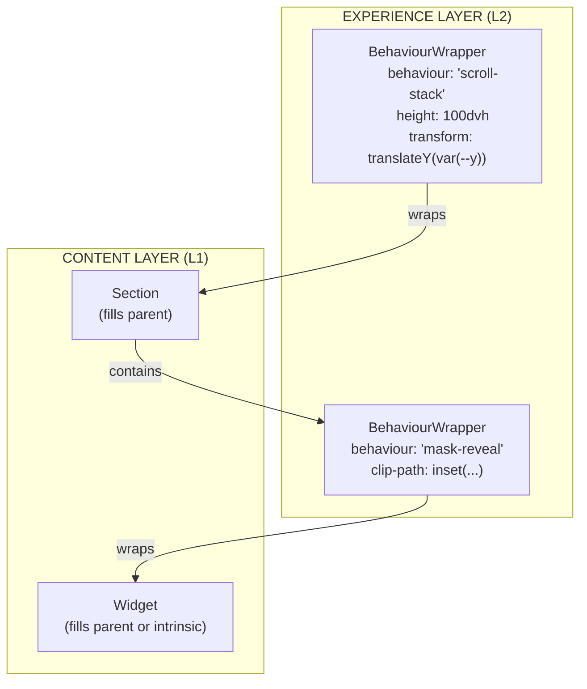

**Key:** L2 wrappers impose extrinsic constraints. L1 content fills or sizes intrinsically.

---

## Rendering

### The Contract

The separation of concerns between Schema, React, Driver, and CSS.

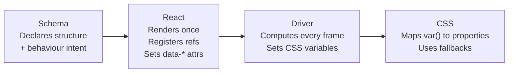

---

### Widget Renderer

How the renderer wraps widgets with the generic BehaviourWrapper.

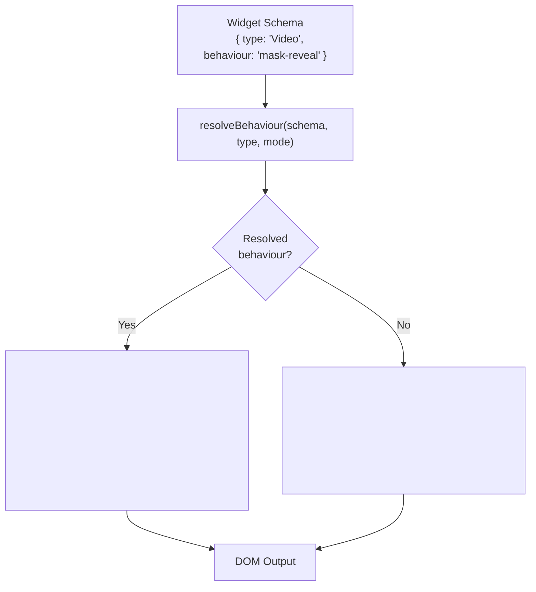

---

### Section Renderer

How sections are wrapped with BehaviourWrapper.

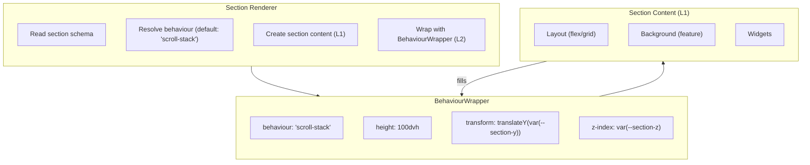

---

### Chrome Resolution

How chrome is resolved between site and page levels.

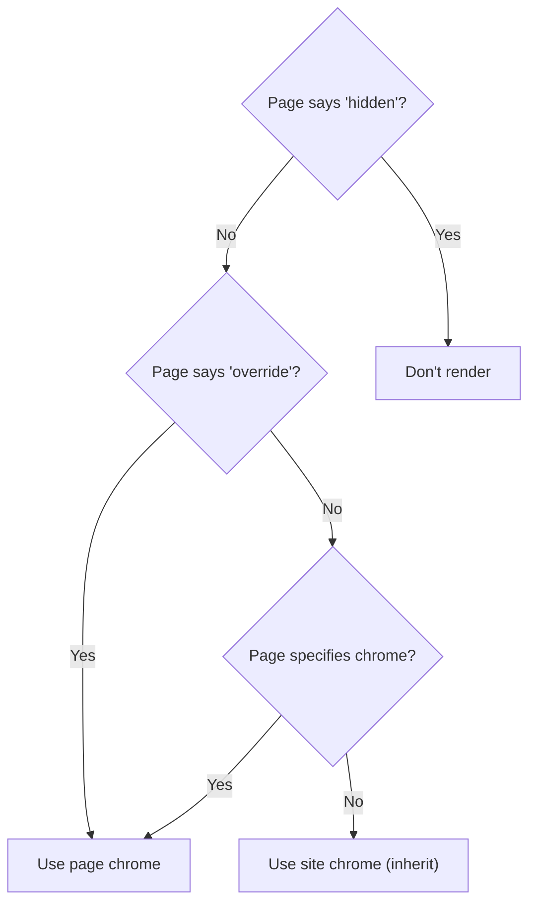

---

## Quick Reference

### Layer Summary

| Layer | Purpose |
|-------|---------|
| **Schema** | Type definitions |
| **Content (L1)** | What is on the page |
| **Experience (L2)** | How the page feels |
| **Presets** | Full configurations (content + experience) |
| **Site** | Instance data |
| **Renderer** | Schema to Components |

### Key Concepts

| Concept | What it is |
|---------|------------|
| **Mode** | Animation configuration with defaults |
| **Behaviour** | Compute function (state to CSS vars) |
| **BehaviourWrapper** | ONE generic wrapper component |
| **Preset** | Full site starting point |

### The Core Insight

```
React handles structure.
Drivers handle motion.
They don't share style properties.
```

### The Frame Pattern (ASCII)

```
+-- BehaviourWrapper (L2) --+
|   size, clip, position    |  <-- Extrinsic (context-imposed)
|   +-- Content (L1) ----+  |
|   |  fills parent      |  |  <-- Intrinsic (content-based)
|   +--------------------+  |
+---------------------------+
```

### Resolution Flow

```
Schema defines intent
        |
        v
Mode provides defaults
        |
        v
Behaviour computes CSS vars
        |
        v
Driver applies to DOM
        |
        v
CSS maps vars to properties
```

---

## See Also

- [Philosophy](../core/philosophy.spec.md) - Core principles and design rationale
- [Contracts](../core/contracts.spec.md) - Layer boundaries and rules
- [Content Layer](../layers/content.spec.md) - Widgets, sections, chrome
- [Experience Layer](../layers/experience.spec.md) - Modes, behaviours, drivers
- [Preset Layer](../layers/preset.spec.md) - Full site starting points
