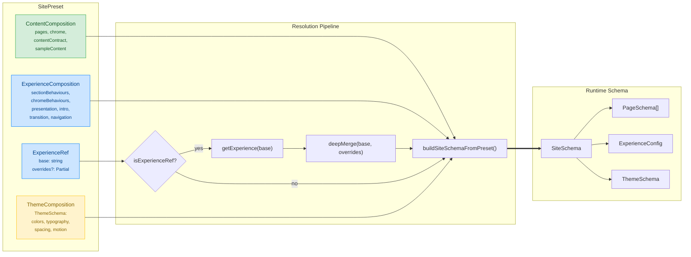
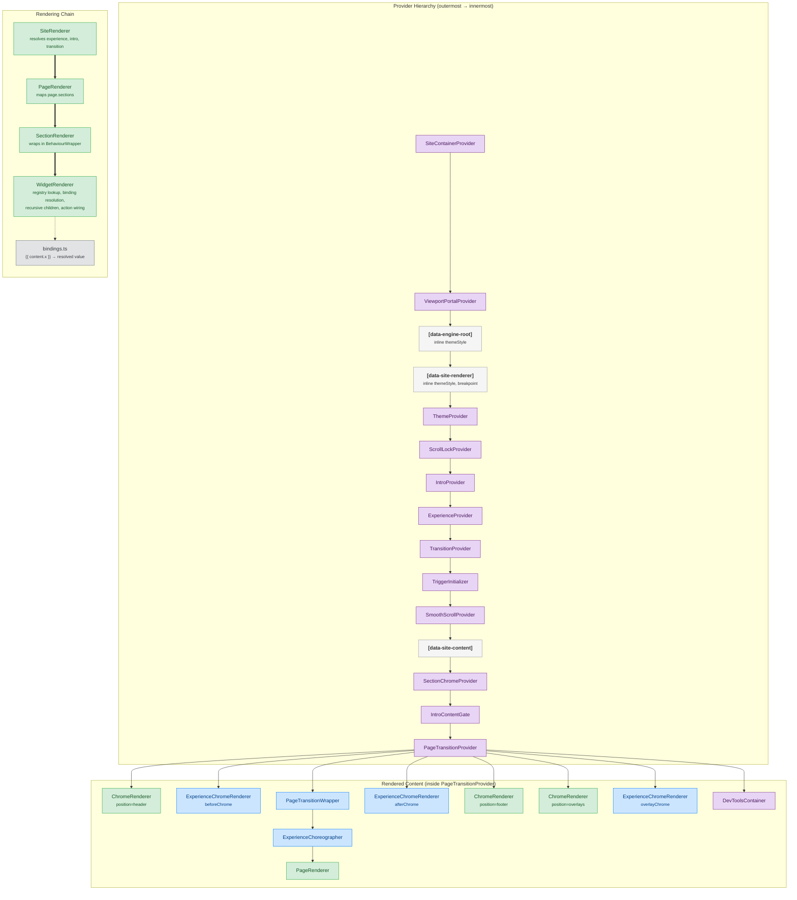
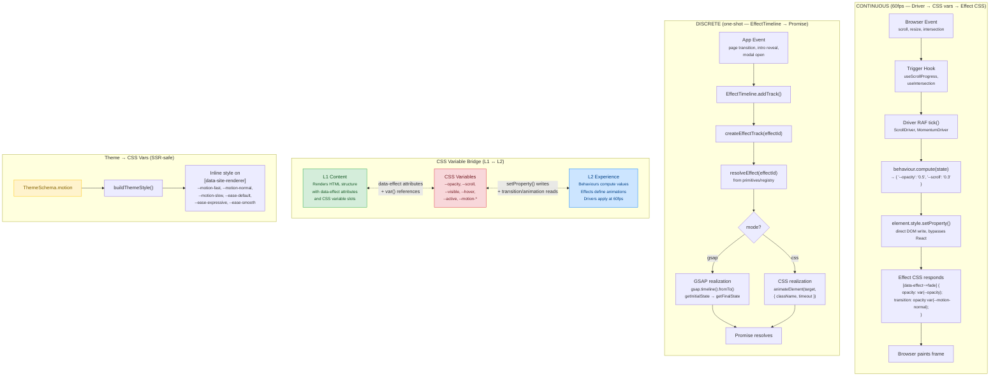

# Creativeshire Engine — Architecture

> Auto-generated architecture reference. 287 architecture tests pass (16 test files).

## Table of Contents

1. [Composable Containers](#1-composable-containers) — How L1, L2, and Theme compose into a SitePreset
2. [L1 Content Internals](#2-l1-content-internals) — Widgets, Sections, Chrome, Actions
3. [L2 Experience Internals](#3-l2-experience-internals) — Behaviours, Drivers, Timeline, Effects, Experiences
4. [Renderer Pipeline](#4-renderer-pipeline) — Provider nesting and rendering chain
5. [Animation Pipelines](#5-animation-pipelines) — Continuous (60fps) vs Discrete (one-shot)

---

## 1. Composable Containers

A `SitePreset` is a thin composition of three independent containers. `buildSiteSchemaFromPreset()` bridges the preset world to the runtime `SiteSchema`.

**Key files:** `engine/presets/types.ts`, `engine/presets/resolve.ts`, `engine/schema/site.ts`

---

## 2. L1 Content Internals

The content layer renders static structure: widgets compose into sections, sections compose into pages, chrome provides persistent site-wide UI.

```mermaid
flowchart TD
    subgraph Widgets["Widgets (17 global + 6 scoped)"]
        direction LR
        PRIM["Primitives<br/><small>Text, Image, Icon,<br/>Button, Link</small>"]:::l1
        LAY["Layout<br/><small>Flex, Box, Stack, Grid,<br/>Split, Container, Marquee</small>"]:::l1
        INT["Interactive<br/><small>Video, VideoPlayer,<br/>EmailCopy, ContactBar</small>"]:::l1
        REP["Repeaters<br/><small>ExpandRowImageRepeater</small>"]:::l1
    end

    subgraph WidgetRegs["Widget Registries"]
        WR["widgetRegistry<br/><small>getWidget(type) → Component</small>"]:::registry
        MR["meta-registry<br/><small>getWidgetMeta(type) → Meta</small>"]:::registry
        SR["registerScopedWidget<br/><small>Section__Widget → Component</small>"]:::registry
    end

    subgraph Sections["Sections (14 patterns)"]
        direction LR
        HERO["Hero<br/><small>HeroVideo, HeroTitle</small>"]:::l1
        ABOUT["About<br/><small>AboutBio, AboutCollage</small>"]:::l1
        PROJ["Projects<br/><small>Featured, Strip, VideoGrid,<br/>Expand, Showcase, Gallery,<br/>Compare, Tabs</small>"]:::l1
        TEAM["Team / Content<br/><small>TeamShowcase,<br/>ContentPricing</small>"]:::l1
    end

    subgraph SectionRegs["Section Registry"]
        SREG["sectionRegistry<br/><small>createEntry(id, meta, getFactory)</small>"]:::registry
        SMETA["defineSectionMeta()<br/><small>settings, sectionCategory</small>"]:::registry
        SCONT["content.ts<br/><small>SectionContentDeclaration:<br/>label, contentFields, sampleContent</small>"]:::l1
    end

    subgraph Chrome["Chrome (8 patterns + 5 overlays)"]
        direction LR
        CPAT["Region Patterns<br/><small>FixedNav, CenteredNav,<br/>MinimalNav, ContactFooter,<br/>BrandFooter, FloatingContact</small>"]:::l1
        COVR["Overlay Components<br/><small>ModalRoot, CursorLabel,<br/>SlideIndicators, NavTimeline,<br/>FixedCard</small>"]:::l1
        CPOV["Overlay Patterns<br/><small>CursorTracker, VideoModal</small>"]:::l1
    end

    subgraph ChromeRegs["Chrome Registries"]
        PREG["pattern-registry<br/><small>getChromePattern(id)</small>"]:::registry
        CREG["chrome/registry<br/><small>registerChromeComponent</small>"]:::registry
    end

    subgraph Actions["Actions (pub/sub)"]
        AREG["registerAction / executeAction<br/><small>{overlayKey}.{verb}</small>"]:::registry
        ASCAN["scanner.ts<br/><small>collectWidgetActions,<br/>collectSectionActions</small>"]:::l1
        ARES["resolver.ts<br/><small>resolveRequiredOverlays</small>"]:::l1
    end

    PRIM & LAY & INT & REP --> WR & MR
    HERO & ABOUT & PROJ & TEAM --> SREG
    SREG --- SMETA & SCONT
    CPAT --> PREG
    COVR --> CREG
    CPOV --> PREG

    COVR -.->|"mount: registerAction()"| AREG
    ASCAN -.->|"scan widget.on maps"| AREG
    ARES -.->|"derive missing overlays"| AREG

    classDef l1 fill:#d4edda,stroke:#28a745,color:#155724
    classDef registry fill:#e2e3e5,stroke:#6c757d,color:#383d41
```

**Scoped widgets** (6 total) register via `registerScopedWidget('Section__Widget', Component)` and are side-effect imported in their section factory. They use double-underscore naming: `AboutBio__MarqueeImageRepeater`, `ProjectCompare__VideoCompare`, `ProjectGallery__FlexGalleryCardRepeater`, `ProjectShowcase__FlexButtonRepeater`, `ProjectTabs__TabbedContent`, `TeamShowcase__StackVideoShowcase`.

**Key files:** `engine/content/widgets/registry.ts`, `engine/content/sections/registry.ts`, `engine/content/chrome/pattern-registry.ts`, `engine/content/chrome/registry.ts`, `engine/content/actions/index.ts`

---

## 3. L2 Experience Internals

The experience layer handles all animation and interaction. Two fundamentally different pipelines: **continuous** (drivers + behaviours at 60fps) and **discrete** (timeline + primitives, one-shot).

```mermaid
flowchart TD
    subgraph Experiences["Experiences (5 registered)"]
        EXP["simple | cinematic-portfolio<br/>slideshow | infinite-carousel<br/>cover-scroll"]:::l2
        EREG["experienceRegistry<br/><small>registerExperience()</small>"]:::registry
    end

    subgraph Behaviours["Behaviours (22 registered, 7 categories)"]
        direction LR
        BSCR["scroll/ (8)<br/><small>progress, fade, fade-out,<br/>color-shift, image-cycle,<br/>cover-progress, collapse, reveal</small>"]:::l2
        BHOV["hover/ (3)<br/><small>reveal, scale, expand</small>"]:::l2
        BVIS["visibility/ (2)<br/><small>fade-in, center</small>"]:::l2
        BANI["animation/ (1)<br/><small>marquee</small>"]:::l2
        BINT["interaction/ (1)<br/><small>toggle</small>"]:::l2
        BVID["video/ (1)<br/><small>frame</small>"]:::l2
        BINTR["intro/ (5)<br/><small>content-reveal, text-reveal,<br/>chrome-reveal, scroll-indicator, step</small>"]:::l2
    end

    subgraph BehaviourInfra["Behaviour Infrastructure"]
        BREG["behaviourRegistry<br/><small>registerBehaviour()</small>"]:::registry
        BW["BehaviourWrapper<br/><small>Single behaviour → DOM element</small>"]:::l2
        CBW["ComposedBehaviourWrapper<br/><small>Multi-behaviour → one element</small>"]:::l2
    end

    subgraph ContinuousPipeline["Continuous Pipeline (60fps)"]
        DRV["Drivers<br/><small>ScrollDriver (RAF + IntersectionObserver)<br/>MomentumDriver (inertia scroll)</small>"]:::l2
        COMPUTE["behaviour.compute(state)<br/><small>→ CSSVariables</small>"]:::l2
        SETPROP["element.style.setProperty()<br/><small>--opacity, --scroll, --visible</small>"]:::l2
    end

    subgraph EffectsCSS["Effects CSS (8 mechanism categories)"]
        direction LR
        EFADE["fade/"]:::l2
        ETRANS["transform/<br/><small>slide, scale</small>"]:::l2
        EMASK["mask/<br/><small>wipe, reveal</small>"]:::l2
        EOVERLAY["overlay/"]:::l2
        EOTHER["color-shift/ | emphasis/<br/>marquee/ | reveal/"]:::l2
    end

    subgraph DiscretePipeline["Discrete Pipeline (one-shot)"]
        ET["EffectTimeline<br/><small>parallel/sequential tracks</small>"]:::l2
        AE["animateElement<br/><small>CSS class animation wrapper</small>"]:::l2
        EFT["createEffectTrack()<br/><small>Bridge: primitive → track</small>"]:::l2
    end

    subgraph Primitives["Effect Primitives (5 registered)"]
        PRIMS["wipe-left | wipe-right<br/>expand | fade | overlay-fade"]:::l2
        PRIMREG["primitives/registry<br/><small>registerEffect() / resolveEffect()</small>"]:::registry
    end

    subgraph Transitions["Page Transitions"]
        TREG["transitionRegistry<br/><small>fade (1 registered)</small>"]:::registry
        PTW["PageTransitionWrapper<br/><small>uses createEffectTrack()</small>"]:::l2
    end

    EXP --> EREG
    EXP -->|"assigns behaviours<br/>to sections/chrome"| BREG
    BSCR & BHOV & BVIS & BANI & BINT & BVID & BINTR --> BREG
    BREG --> BW & CBW

    DRV -->|"RAF tick"| COMPUTE -->|"CSS vars"| SETPROP
    SETPROP -.->|"[data-effect] selectors<br/>respond to CSS vars"| EFADE & ETRANS & EMASK & EOVERLAY & EOTHER

    ET --> EFT --> PRIMREG
    PRIMS --> PRIMREG
    EFT -->|"GSAP mode"| AE
    EFT -->|"CSS mode"| AE

    TREG --> PTW
    PTW -->|"exitEffect/entryEffect"| EFT

    classDef l2 fill:#cce5ff,stroke:#007bff,color:#004085
    classDef registry fill:#e2e3e5,stroke:#6c757d,color:#383d41
```

**Two "effects" systems (distinct):**
- `experience/effects/` — CSS files with `[data-effect]` selectors. Continuous. Respond to CSS variables set by behaviours.
- `timeline/primitives/` — TypeScript `EffectPrimitive` definitions. Discrete. Consumed by `EffectTimeline` via `createEffectTrack()`.

**Key files:** `engine/experience/behaviours/registry.ts`, `engine/experience/drivers/ScrollDriver.ts`, `engine/experience/timeline/primitives/registry.ts`, `engine/experience/timeline/effect-track.ts`, `engine/experience/compositions/registry.ts`

---

## 4. Renderer Pipeline

`SiteRenderer` composes providers and renders the component tree. Provider nesting order matches the actual JSX in `SiteRenderer.tsx`.

**Ensure calls at module top:** `ensureExperiencesRegistered()`, `ensurePresetsRegistered()`, `ensurePageTransitionsRegistered()`, `ensureChromeRegistered()`, `ensureThemesRegistered()` — guarantees all registries are populated before any lookups.

**Key files:** `engine/renderer/SiteRenderer.tsx`, `engine/renderer/PageRenderer.tsx`, `engine/renderer/SectionRenderer.tsx`, `engine/renderer/WidgetRenderer.tsx`, `engine/renderer/bindings.ts`

---

## 5. Animation Pipelines

Two fundamentally different data flows. They share no code paths — only CSS variables bridge L1 content and L2 experience.

**Key distinction:** Continuous pipeline bypasses React entirely (direct DOM writes via `element.style.setProperty()`). Discrete pipeline returns Promises and is used for orchestrated sequences.

---

## Validation Report

| Step | Layer | Status | Summary |
|------|-------|--------|---------|
| 1 | Schema | PASS | ThemeSchema includes MotionConfig. ExperienceConfig references behaviours/intro/transition. All types re-exported from index.ts. content-field.ts exports SectionContentField + SectionContentDeclaration. |
| 2 | L1 Widgets | PASS | 17 global widgets (5 primitives, 7 layout, 4 interactive, 1 repeater). All registered in widgetRegistry + meta-registry. All meta.ts use defineMeta(). |
| 3 | L1 Sections | PASS | 14 patterns, each with index.ts, meta.ts, types.ts, content.ts, styles.css, preview.ts. All use applyMetaDefaults(). All registered via createEntry(). 6 scoped widgets with __ naming. |
| 4 | L1 Chrome | PASS | 8 chrome patterns (factory-based, 3 header + 2 footer + 1 floating + 2 overlay patterns). 5 overlay components registered in chrome/registry.ts. |
| 5 | L1 Actions | PASS | registerAction/executeAction/hasAction exported. Scanner collects widget actions across pages. Resolver derives missing overlays. |
| 6 | L2 Behaviours | PASS | 22 behaviours across 7 trigger categories. All registered via registerBehaviour(). BehaviourWrapper + ComposedBehaviourWrapper exported. |
| 7 | L2 Effects CSS | PASS | 8 mechanism categories imported in effects/index.css. All use [data-effect~="name"] selectors. All include prefers-reduced-motion blocks. |
| 8 | L2 Timeline | PASS | primitives/ folder (renamed from effects/) has 5 registered primitives. effect-track.ts imports from ./primitives/ (correct). gsap/use-gsap-reveal.ts imports from ../primitives/ (correct). Zero imports from old timeline/effects/ path. |
| 9 | L2 Drivers | PASS | ScrollDriver (RAF + IntersectionObserver), MomentumDriver, getDriver factory all present. |
| 10 | L2 Experiences | PASS | 5 experiences registered (simple, cinematic-portfolio, slideshow, infinite-carousel, cover-scroll). Lazy loading supported. |
| 11 | L2 Transitions | PASS | 1 transition registered (fade). PageTransitionWrapper uses createEffectTrack(). |
| 12 | Renderer | PASS | buildThemeStyle() includes all motion tokens. Provider hierarchy: 15 levels verified against JSX. All ensure*Registered() calls at module top. |
| 13 | Presets | PASS | 4 presets (noir, loft, prism, test-multipage). All export meta + contentContract. buildSiteSchemaFromPreset() handles ExperienceRef. content-utils.ts has buildContentContract/buildSampleContent/withContentBindings. |
| 14 | Themes | PASS | 12 themes auto-registered. paletteToCSS, typographyToCSS, tokensToCSS all present. SiteRenderer integrates theme + motion tokens as inline styles. |
| 15 | Interface | PASS | EngineProvider, ContainerContext, EngineStore, discovery API all present. |
| 16 | Intro | PASS | IntroProvider, IntroContentGate, usePhaseController (uses createEffectTrack for reveal effects), 2 sequences (video-hero-gate, wait). |
| 17 | Config | PASS | breakpoints.ts with responsive breakpoint definitions. |
| 18 | Tests | PASS | **287 tests pass** across 16 test files. Theme compliance baselines tracked (26 font-size, 40 font-weight, 42 spacing violations — all at or below baseline). |

---

## Entity Counts

| Category | Count | Details |
|----------|-------|---------|
| Architecture tests | 287 | 16 test files |
| Global widgets | 17 | 5 primitives, 7 layout, 4 interactive, 1 repeater |
| Scoped widgets | 6 | Section-specific, __ naming convention |
| Section patterns | 14 | 2 hero, 2 about, 8 project, 1 team, 1 content |
| Chrome patterns | 8 | 3 header, 2 footer, 1 floating, 2 overlay |
| Chrome overlays | 5 | ModalRoot, CursorLabel, SlideIndicators, NavTimeline, FixedCard |
| Behaviours | 22 | scroll/8, hover/3, visibility/2, animation/1, interaction/1, video/1, intro/5 |
| Effect CSS categories | 8 | color-shift, emphasis, fade, marquee, mask, overlay, reveal, transform |
| Timeline primitives | 5 | wipe-left, wipe-right, expand, fade, overlay-fade |
| Experiences | 5 | simple, cinematic-portfolio, slideshow, infinite-carousel, cover-scroll |
| Page transitions | 1 | fade |
| Drivers | 2 | ScrollDriver, MomentumDriver |
| Themes | 12 | contrast, muted, editorial, neon, earthy, monochrome, crossroad, azuki, boy-mole, the21, supercell, riot-games |
| Presets | 4 | noir, loft, prism, test-multipage |
